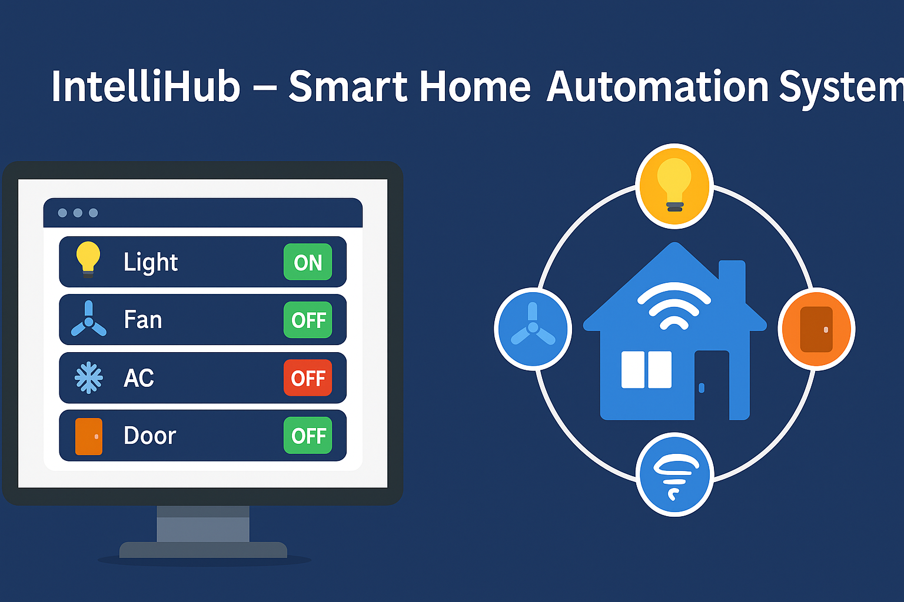

# 🔌 IntelliHub – Smart Home Automation System

Take control of your home with **IntelliHub**, a fully integrated smart automation system enabling seamless remote control of lights, fans, ACs, and doors via a real-time web dashboard.

---

## 🚀 Features

- 🖥️ **Web-based control panel** (PHP + WebSocket)  
- 📡 **Real-time device status updates**  
- 🔌 **ESP32-based appliance management**  
- 💡 **Visual feedback** for ON/OFF states  
- 🔐 **Secure & scalable** architecture

---

## ⚙️ Installation

1. Flash `ESP32_code.ino` to your ESP32 using the Arduino IDE.  
2. Set up a local server (XAMPP/WAMP) and place `index.php`, `websocket.php`, and image assets into the `htdocs` directory.  
3. Start the Apache server.  
4. Open `http://localhost/index.php` in your browser.  

> ✅ **Tip**: Ensure `websocket.php` is running in a separate terminal to enable real-time updates.

---

## 🛠️ Tech Stack

- **Frontend**: HTML, CSS, JavaScript  
- **Backend**: PHP, WebSocket  
- **Microcontroller**: ESP32  
- **Assets**: PNG icons for device state visualization

---

## 🤝 Contributing

Got ideas or improvements?  
Feel free to fork this repo, submit issues, or raise pull requests! Contributions are highly appreciated.

---

## 📄 License

This project is licensed under the **MIT License**.  
See the [LICENSE](./LICENSE) file for more info.
